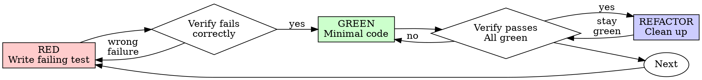

# Test-driven development (TDD)

Write the test first. Watch it fail. Write minimal code to pass.

**Core principle:** If you didn't watch the test fail, you don't know if it
tests the right thing.

**Violating the letter of the rules is violating the spirit of the rules.**

Non-trivial implementation work reaches this cycle through the implementation
stage of [[skill:code-writing-flow]]: [[agent:code-writer]] runs RED-GREEN-REFACTOR
with its test-writer subagent. This skill governs any code you write directly —
the discipline is identical either way.

## When to use

**Always:** new features, bug fixes, refactoring, behavior changes.

**Exceptions (ask the user):** throwaway prototypes, generated code,
configuration files.

Thinking "skip TDD just this once"? Stop. That's rationalization.

## The Iron Law

```
NO PRODUCTION CODE WITHOUT A FAILING TEST FIRST
```

Write code before the test? Delete it. Start over.

**No exceptions:**

- Don't keep it as "reference"
- Don't "adapt" it while writing tests
- Don't look at it
- Delete means delete

Implement fresh from tests. Period.

## Red-Green-Refactor



### RED — write the failing test

Write one minimal test showing what should happen.

<Good>
```typescript
test('retries failed operations 3 times', async () => {
  let attempts = 0;
  const operation = () => {
    attempts++;
    if (attempts < 3) throw new Error('fail');
    return 'success';
  };

  const result = await retryOperation(operation);

  expect(result).toBe('success');
  expect(attempts).toBe(3);
});
```
Clear name, tests real behavior, one thing
</Good>

<Bad>
```typescript
test('retry works', async () => {
  const mock = jest.fn()
    .mockRejectedValueOnce(new Error())
    .mockRejectedValueOnce(new Error())
    .mockResolvedValueOnce('success');
  await retryOperation(mock);
  expect(mock).toHaveBeenCalledTimes(3);
});
```
Vague name, tests mock not code
</Bad>

**Requirements:** one behavior, clear name, real code (no mocks unless
unavoidable).

### Verify RED — watch it fail

**MANDATORY. Never skip.** Run the test and confirm:

- The test fails (not errors)
- The failure message is expected
- It fails because the feature is missing (not typos)

**Test passes?** You're testing existing behavior. Fix the test.

**Test errors?** Fix the error, re-run until it fails correctly.

### GREEN — minimal code

Write the simplest code to pass the test.

<Good>
```typescript
async function retryOperation<T>(fn: () => Promise<T>): Promise<T> {
  for (let i = 0; i < 3; i++) {
    try {
      return await fn();
    } catch (e) {
      if (i === 2) throw e;
    }
  }
  throw new Error('unreachable');
}
```
Just enough to pass
</Good>

<Bad>
```typescript
async function retryOperation<T>(
  fn: () => Promise<T>,
  options?: {
    maxRetries?: number;
    backoff?: 'linear' | 'exponential';
    onRetry?: (attempt: number) => void;
  }
): Promise<T> {
  // YAGNI
}
```
Over-engineered
</Bad>

Don't add features, refactor other code, or "improve" beyond the test.

### Verify GREEN — watch it pass

**MANDATORY.** Run the test and confirm: the test passes, other tests still
pass, output is pristine (no errors, warnings).

**Test fails?** Fix the code, not the test.

**Other tests fail?** Fix now.

### REFACTOR — clean up

After green only: remove duplication, improve names, extract helpers. Keep
tests green. Don't add behavior.

### Repeat

Next failing test for the next behavior.

## Good tests

| Quality | Good | Bad |
|---------|------|-----|
| **Minimal** | One thing. "and" in the name? Split it. | `test('validates email and domain and whitespace')` |
| **Clear** | Name describes behavior | `test('test1')` |
| **Shows intent** | Demonstrates the desired API | Obscures what the code should do |

## Why order matters

**"I'll write tests after to verify it works"**

Tests written after code pass immediately. Passing immediately proves nothing:
they might test the wrong thing, test implementation instead of behavior, or
miss the edge cases you forgot. You never saw the test catch the bug.
Test-first forces you to see the test fail, proving it actually tests
something.

**"I already manually tested all the edge cases"**

Manual testing is ad-hoc: no record of what you tested, can't re-run when code
changes, easy to forget cases under pressure. Automated tests are systematic —
they run the same way every time.

**"Deleting X hours of work is wasteful"**

Sunk cost fallacy. The time is already gone. Your choice now: delete and
rewrite with TDD (high confidence) or keep it and add tests after (low
confidence, likely bugs). The "waste" is keeping code you can't trust.

**"TDD is dogmatic, being pragmatic means adapting"**

TDD IS pragmatic: finds bugs before commit, prevents regressions, documents
behavior, enables refactoring. "Pragmatic" shortcuts = debugging in production
= slower.

**"Tests after achieve the same goals — it's spirit not ritual"**

No. Tests-after answer "what does this do?" Tests-first answer "what *should*
this do?" Tests-after are biased by your implementation: you test what you
built, not what's required, and verify remembered edge cases instead of
discovering them. Coverage without proof the tests work.

## Common rationalizations

| Excuse | Reality |
|--------|---------|
| "Too simple to test" | Simple code breaks. The test takes 30 seconds. |
| "I'll test after" | Tests passing immediately prove nothing. |
| "Tests after achieve same goals" | Tests-after = "what does this do?" Tests-first = "what should this do?" |
| "Already manually tested" | Ad-hoc ≠ systematic. No record, can't re-run. |
| "Deleting X hours is wasteful" | Sunk cost fallacy. Keeping unverified code is technical debt. |
| "Keep as reference, write tests first" | You'll adapt it. That's testing after. Delete means delete. |
| "Need to explore first" | Fine. Throw away the exploration, start with TDD. |
| "Test hard = design unclear" | Listen to the test. Hard to test = hard to use. |
| "TDD will slow me down" | TDD is faster than debugging. Pragmatic = test-first. |
| "Manual test faster" | Manual doesn't prove edge cases. You'll re-test every change. |
| "Existing code has no tests" | You're improving it. Add tests for the existing code. |

## Red flags — STOP and start over

- Code before test
- Test after implementation
- Test passes immediately
- Can't explain why the test failed
- Tests added "later"
- Rationalizing "just this once"
- "I already manually tested it"
- "Tests after achieve the same purpose"
- "It's about spirit not ritual"
- "Keep as reference" or "adapt existing code"
- "Already spent X hours, deleting is wasteful"
- "TDD is dogmatic, I'm being pragmatic"
- "This is different because..."

**All of these mean: delete the code. Start over with TDD.**

## Example: bug fix

**Bug:** empty email accepted.

**RED**
```typescript
test('rejects empty email', async () => {
  const result = await submitForm({ email: '' });
  expect(result.error).toBe('Email required');
});
```

**Verify RED** — run: `FAIL: expected 'Email required', got undefined`.

**GREEN**
```typescript
function submitForm(data: FormData) {
  if (!data.email?.trim()) {
    return { error: 'Email required' };
  }
  // ...
}
```

**Verify GREEN** — run: `PASS`.

**REFACTOR** — extract validation for multiple fields if needed.

## Verification checklist

Before marking work complete:

- [ ] Every new function/method has a test
- [ ] Watched each test fail before implementing
- [ ] Each test failed for the expected reason (feature missing, not typo)
- [ ] Wrote minimal code to pass each test
- [ ] All tests pass
- [ ] Output pristine (no errors, warnings)
- [ ] Tests use real code (mocks only if unavoidable)
- [ ] Edge cases and errors covered

Can't check all boxes? You skipped TDD. Start over.

## When stuck

| Problem | Solution |
|---------|----------|
| Don't know how to test | Write the wished-for API. Write the assertion first. Ask the user. |
| Test too complicated | Design too complicated. Simplify the interface. |
| Must mock everything | Code too coupled. Use dependency injection. |
| Test setup huge | Extract helpers. Still complex? Simplify the design. |

## Debugging integration

Bug found? Write a failing test reproducing it, then follow the TDD cycle — the
test proves the fix and prevents regression. Never fix a bug without a test
(root cause first: [[skill:systematic-debugging]]).

## Testing anti-patterns

Tests must verify real behavior, not mock behavior — mocks isolate, they are
never the thing being tested. The iron rules:

1. **Never test mock behavior.** Asserting a `*-mock` element exists proves the
   mock works, not the component. Test the real thing, or don't assert on the
   mock.
2. **Never add test-only methods to production classes.** A `destroy()` used
   only by tests pollutes production and invites accidents — put cleanup in
   test utilities.
3. **Never mock without understanding the dependency.** Mocking a method whose
   side effect the test depends on makes the test pass for the wrong reason;
   run against the real implementation first, then mock minimally at the
   slow/external level.
4. **Mock the complete data structure.** Partial mocks (only the fields you
   remembered) fail silently when code reads an omitted field — mirror the real
   API's full shape.

Warning signs: mock setup longer than the test logic, tests that break when a
mock changes, mocking "just to be safe". Strict TDD prevents all of these —
if you're testing mock behavior, you added mocks without watching the test
fail against real code first.

## Final rule

```
Production code → test exists and failed first
Otherwise → not TDD
```

No exceptions without the user's permission.

*Adapted from [Superpowers](https://github.com/obra/superpowers) by Jesse
Vincent (MIT).*

## Related skills

- [[skill:systematic-debugging]] — root cause before the failing test, for bug fixes
- [[skill:verification-before-completion]] — evidence before claiming the work done
- [[skill:code-writing-flow]] — the stage order this cycle sits inside
- [[agent:code-writer]] — the implementation stage, which runs this cycle
- [[agent:test-writer]] — writes the failing test (RED) for a stated behavior
- [[agent:test-verifier]] — proves a test genuinely bites
